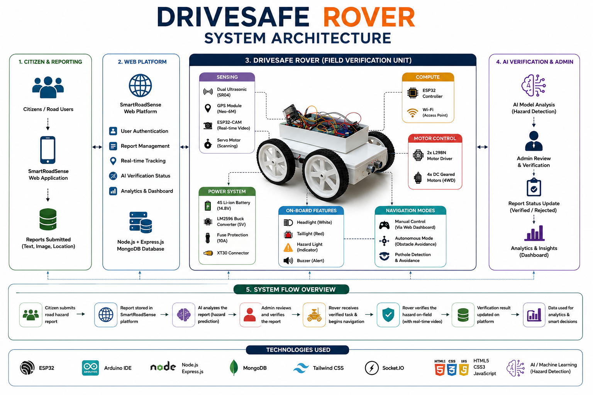
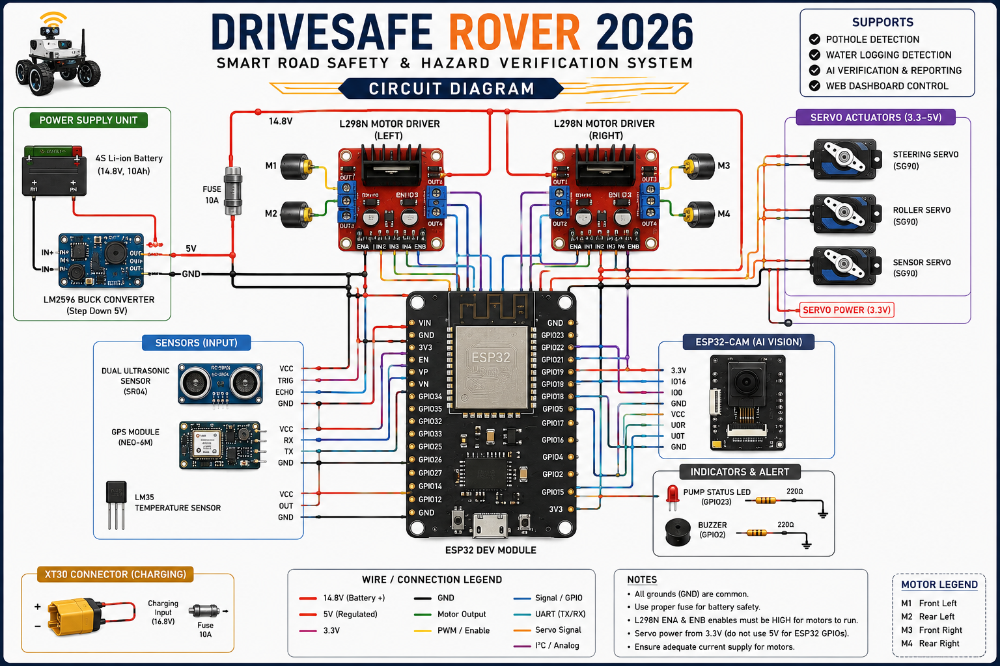
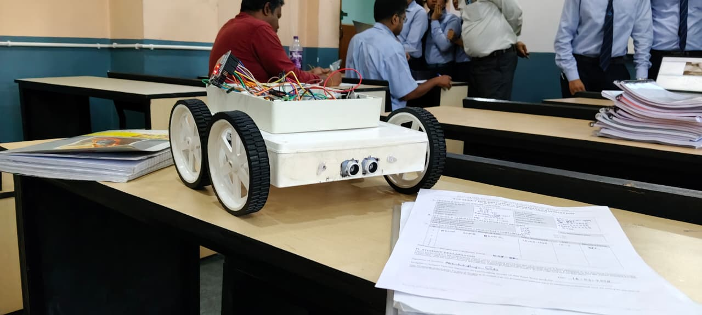
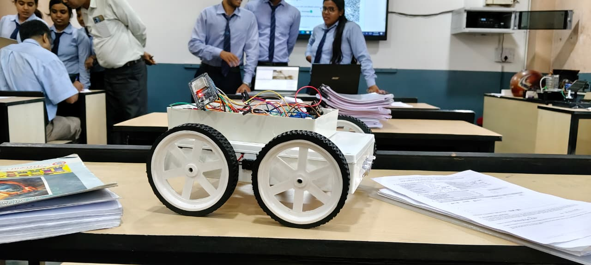
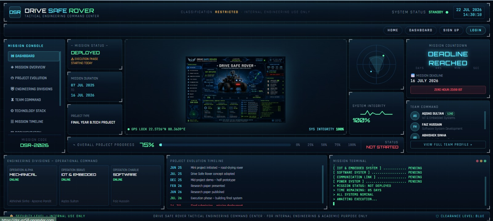
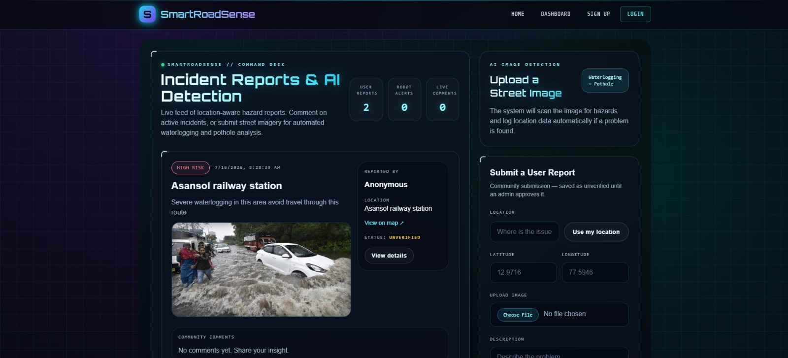
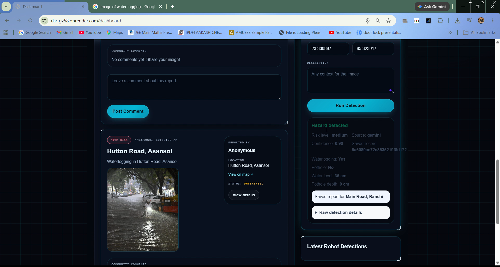

<div align="center">

# 🚗 DriveSafe Rover

### Smart AI-Powered Road Hazard Detection & Monitoring System


</div>

---

# 📖 Project Overview

DriveSafe Rover is a smart autonomous road inspection and monitoring system designed to detect road hazards such as potholes and waterlogged areas. The rover combines embedded systems, IoT communication, GPS tracking, and a web-based monitoring dashboard to provide real-time hazard reporting and verification.

The project integrates hardware, firmware, and web technologies into a complete end-to-end smart road safety solution.

---

# ✨ Key Features

- 🚗 Autonomous & Manual Driving Modes
- 📍 GPS Location Tracking
- 📡 Wi-Fi Communication
- 📷 ESP32-CAM Live Streaming
- 📏 Ultrasonic-based Hazard Detection
- 💡 Headlights, Tail Lights & Hazard Indicators
- 🌐 Web Dashboard for Monitoring
- 🤖 AI-assisted Incident Verification
- 📊 Real-time Incident Management
- 📄 Complete Documentation & System Architecture

---

# 🏗️ System Architecture

<p align="center">

</p>

---

# 🔌 Circuit Diagram

<p align="center">

</p>

---

# 🛠 Hardware Components

| Component | Description |
|-----------|-------------|
| ESP32 Dev Module | Main Controller |
| ESP32-CAM | Live Video Streaming |
| GPS Module | Location Tracking |
| Ultrasonic Sensors | Hazard Detection |
| Dual L298N Driver | Motor Control |
| DC Gear Motors | Vehicle Movement |
| Servo Motors | Camera & Sensor Rotation |
| LM2596 Buck Converter | Voltage Regulation |
| Li-ion Battery Pack | Power Supply |
| LED Indicators | Headlight, Tail Light & Hazard Light |

---

# 💻 Software Stack

| Category | Technologies |
|----------|--------------|
| Firmware | Arduino IDE, ESP32 |
| Frontend | HTML, CSS, JavaScript |
| Backend | Flask (Python) |
| Database | JSON |
| Communication | Wi-Fi |
| Version Control | Git & GitHub |

---

# 📂 Repository Structure

```text
DriveSafe-Rover/
│
├── docs/
├── firmware/
├── hardware/
├── media/
├── website/
│
├── README.md
├── LICENSE
└── .gitignore
```

---

# 📷 Project Gallery

## Rover Prototype

<p align="center">


</p>

---

# 🌐 Web Dashboard

<p align="center">

</p>

<p align="center">

</p>

<p align="center">

</p>

---

# 🚀 Firmware Features

- Differential Drive Control
- Autonomous Navigation
- Manual Web Control
- GPS Tracking
- Ultrasonic Sensor Monitoring
- Servo-based Camera Scanning
- Headlight Control
- Tail Light Control
- Hazard Light Blinking
- ESP32-CAM Wi-Fi Streaming
- AJAX-based Live Dashboard Updates

---

# 📑 Documentation

Project documentation is available inside the **docs/** directory.

- 📄 Final Project Report
- 🔌 Circuit Connections
- 🏗️ System Architecture
- ⚡ Circuit Diagram

---

# 🔮 Future Enhancements

- AI-based Road Damage Classification
- Mobile Application
- Cloud Database Integration
- Real-time Navigation
- LTE/5G Communication
- Solar Charging System
- Edge AI Processing
- Multi-Rover Coordination

---

# 👥 Team Members

- Abhishek Ranjan Sinha
- Aqdas Sultan
- Apoorv Pandit
- Faiz Hussain

---

# 🙏 Acknowledgements

We sincerely thank our faculty members, mentors, and our institution for their continuous guidance and support throughout the development of this project.

---

# 📜 License

This project is licensed under the **MIT License**.

See the **LICENSE** file for more information.

---

<div align="center">

### ⭐ If you found this project interesting, don't forget to star this repository!

Made with ❤️ by the DriveSafe Rover Team

</div>
